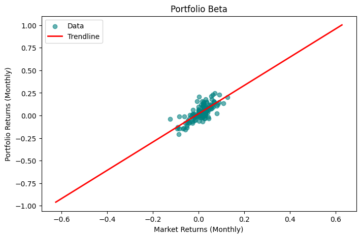

# Portfolio-Beta
This Jupyter Notebook calculates the beta of a portfolio of stocks using my custom-built linear regression package (LinReg).

## Project Goal
This notebook aims to determine the systematic risk, or Beta, of a stock portfolio relative to the S&P 500. 

This project serves as a real-world integreation test for the [LinReg Package](https://github.com/SRem-07/Regression) which I created, moving beyond unit tests to real world financial data. 

## Tech Stack
* **Analysis:** Python (NumPy, Pandas)
* **Data Source:** 'yfinance' (Yahoo Finance API)
* **Modeling:** [LinReg](https://github.com/SRem-07/Regression) (Custom OLS implementation)
* **Visualisation:** Matplotlib (through the LinReg package)

## Methodology
* **Data Acquisition:** 10 years of historical monthly adjusted closing prices for AAPL, TSLA, NVDA, AMD, and AMZN.
* **Portfolio Construction:** Weughted returns based on portfolio allocation
* **Market Comparison:** Monthly returns of the S&P 500
* **Regression:** Using the 'LinReg' package to perfom  OLS regression:
  * **X**: Market monthly returns
  * **Y**: Portfolio monthly returns
  * **Beta**: The resulting coefficient of the model, showing sensitivity of the portfolio's returns to that of the market.
* **Diagnostics:** Using the LinReg package (Plot.plot_diagnostics(model)) to determine model suitability:
  * Residuals vs Fitted
  * QQ plot of residuals

## Key Results
- **Portfolio Beta:** 1.57 (indicates portfolio retunrs are ~57% more volatile than the market)
- **R-Squared:** 0.587 (explaines ~59% of variance)



## Usage
You can clone and use the notebook using the following:
``` bash
git clone https://github.com/SRem-07/Portfolio-Beta.git 
```
Also ensure you have the required libraries:
``` bash
pip install -r path/to/requirements.txt